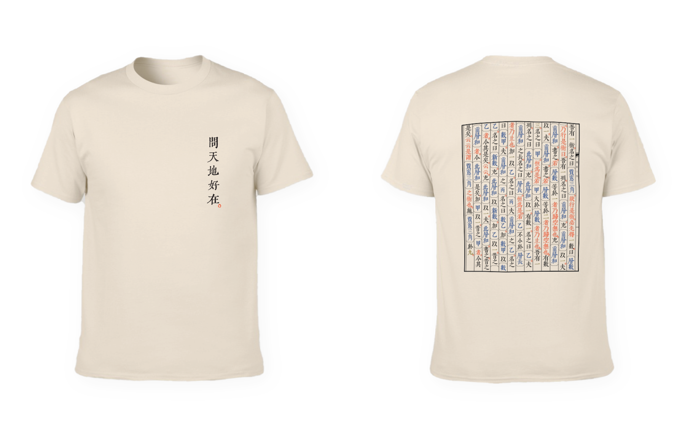

<h1 align='center'>Wenyan Shirt</h1>

The Open Source T-Shirt for Wenyan

This repo hosts the source files of this T-shirt design that you can print freely as you want.

<h3 align='center'>Source</h3>

- The Programming Language, [wenyan-lang - 文言文編程語言](https://github.com/wenyan-lang/wenyan)

- The Font, [QIJI Font - 齊伋體](https://github.com/LingDong-/qiji-font) by [@LingDong-](https://github.com/LingDong-)

- The Code, [`pascal_triangle.wy` - 賈憲三角](https://github.com/wenyan-lang/wenyan/blob/master/examples/pascal_triangle.wy) by [@MerakDipper](https://github.com/MerakDipper)

- The Image Generator, [`render.ts`](https://github.com/wenyan-lang/wenyan/blob/master/src/render.ts)

<h3 align='center'>Download</h3>

Just <a href="https://github.com/antfu/wenyan-tshirt/master.zip">download this repo</a> ;)

## License

This work is licensed under a [Creative Commons Attribution 4.0 International License](https://creativecommons.org/licenses/by/4.0/).

[Anthony Fu](https://github.com/antfu) CC BY 4.0 